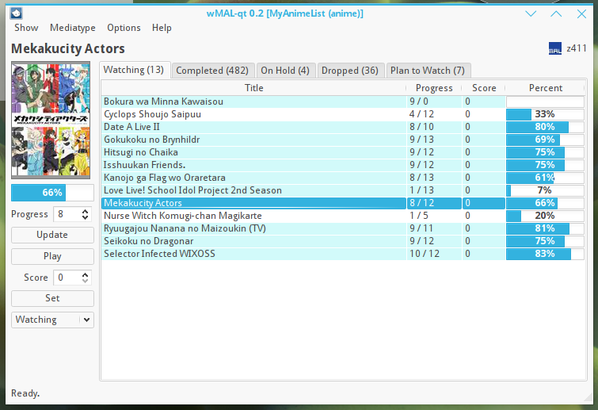
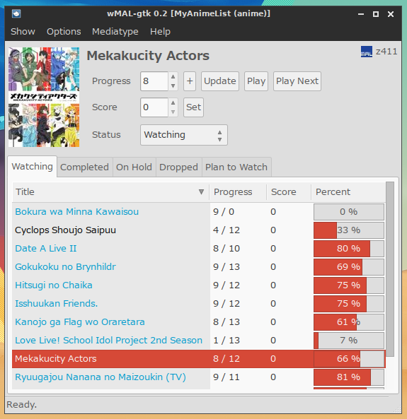
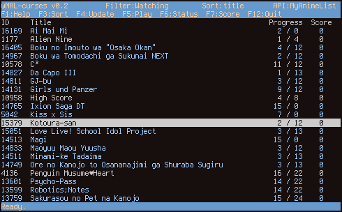
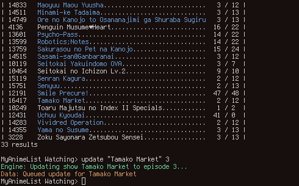

========
Overview
========

Features
========

* Manage local list and synchronize when necessary, useful when offline
* Manage multiple accounts on different sites like MyAnimeList, Melative, Hummingbird or VNDB.
* Support for several mediatypes depending on the site (like VNs, anime, manga, LNs)
* Multiple user interfaces (Qt, GTK, curses, command-line)
* Detection of running media player, updates list if necessary
* Ability to launch media player for a requested media in the list and update list if necessary
* Highly scalable, easy to code new interfaces and support for other sites

Interfaces
==========

As mentioned, wMAL provides different interfaces to fit your environment better.

`wmal-qt` -- Qt Interface
-------------------------
The Qt interface is coded using PyQt4, and it provides a simple and intuitive interface for Qt users.
Porting to PyQt5 is planned.

`wmal-gtk` -- GTK Interface
---------------------------
The GTK interface is coded using PyGTK 2, and it provides a feature complete interface for GTK users.
A GTK 3 interface is not planned.

`wmal-curses` - curses Interface
--------------------------------
The curses interface is coded using the urwid library, and it provides an intuitive terminal based interface
with the same functionality as the previously mentioned GUIs.

`wmal` -- CLI
-------------
The command-line interface is a simple command based interface to wMAL, mostly used for development and debugging,
but it can also be used if you really don't want to install any dependencies.

